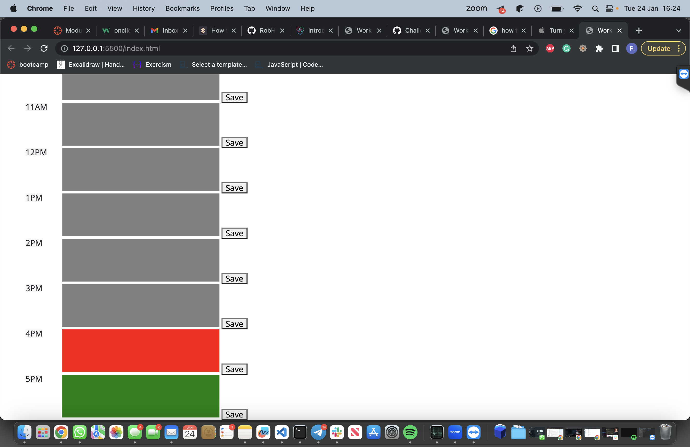

# Work-Calendar

* [Usage](#usage)
* [Screenshots](#screenshots)
* [License](#license)

## Usage
Allows user to write in the calendar, after typing a goal or objective in the given time stamp. the user can save it with a button and if they leave the site, the text will still be there, until otherwise changed by the user. The boxes will also change colour, dependent on the hour of the working day, green for future hours, red for current hour and grey for past hours. As ilustrated in the image below

Or open in [GitHub Pages] https://robh95.github.io/Challenge7-Calendar/

## Screenshots

## License
MIT license - included in LICENSE